

    

<h1> # DIO-Azure-Devops  </h1>

<h1>BootCamp : Azure Databricks </h1>

# Projeto : Devops Azure

 > **Objetivo:** Este repositório foi desenvolvido durante o curso BootCamp Azure Databricks na plataforma da [DIO](https://dio.me)

Projeto com o objetivo de gerar evidência do conhecimento absorvido no treinamento de utilização da plataforma Azure Devops .

Iremos configurar um Devops Azure e a sequencia vamos criar um  Azure Data Factory e verificar todo o processo de versionamento no Azure Devops durante a configuração do Data Factory.
Iremos documentar neste repositorio os passos, para comprovação de entendimento e conhecimento.

## 💻 Tecnologias utilizadas no projeto

- [Github] 
- [Azure]
    -> Data Factory
- [Devops]
    -> Boards
    -> Repos

##    Desciption
 
Entendendo o Desafio
Agora é a sua hora de brilhar e construir um perfil de destaque na DIO! Explore todos os conceitos explorados até aqui e replique (ou melhore, porque não?) este projeto prático. Para isso, crie seu próprio repositório e aumente ainda mais seu portfólio de projetos no GitHub, o qual pode fazer toda diferença em suas entrevistas técnicas 😎

Como entregar esse projeto?
Chegou a hora de você construir um portfólio ainda mais rico e impressionar futuros recrutadores, para isso é sempre importante mostrar os resultados do seu esforço
e como você os obteve deixando claro o seu racional, para isso faça da seguinte maneira:

1. Crie um novo repositório no github com um nome a sua preferência
2. Crie um arquivo chamado readme.md;
3.    Deixe alguns prints ;
4.    Descreva o processo, alguns insights e possibilidades que você aprendeu durante o conteúdo;
5.    Após a IA analisar suas sentenças
6. Compartilhe conosco o link desse repositório através do botão 'entregar projeto'

 
## ✨ Solution
  A abordagem para a solução e apresentação é baseada em atividades, que serão descritas abaixo.

  <h3>Atividade 1 </h3>
  1) Aqui iremos fazer a configuração do Azure Devops, para tal precisamos definir algumas configurações, como organização
  , projeto, repositorio , branch, ou seja, precisamos definir a nossa estrutura de repositório. Abaixo iremos acompanhar a criação

  Imagens da criação da organização
  

    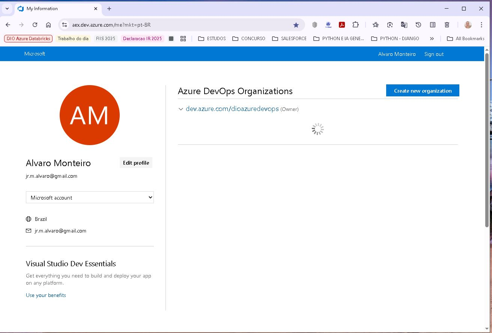
  

  Logado na organização
  
&emsp;&nbsp; Vemos que já temos um projeto criado, que e o "dio azure devops projects"

  

    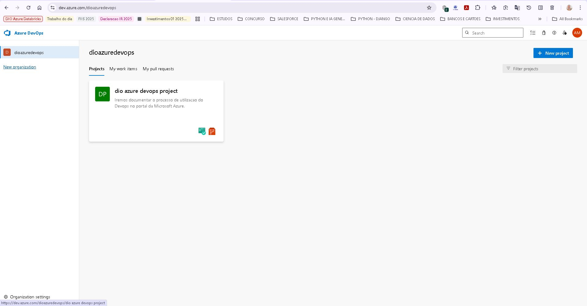
  

  
&emsp;&nbsp; Vamos fazer um overview nas onfigurações da organização

  

    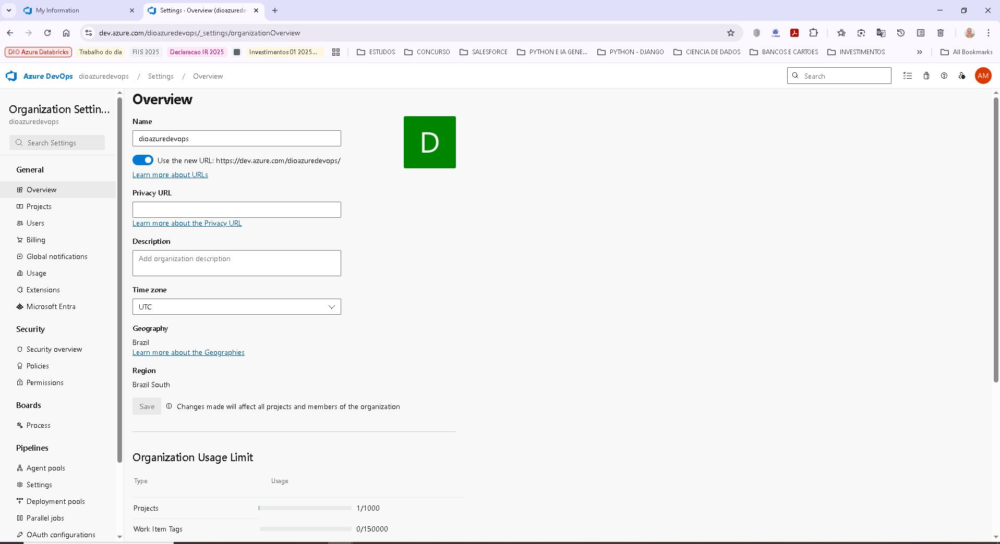
  

  

    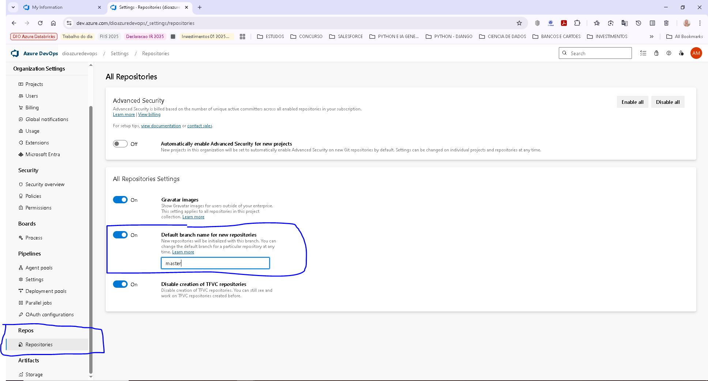
    Em Repos, podemos ver que podemos habilitar e definir o nome de uma branch inicial em cada repositorio, na imagem vemos o exemplo
    da troca de "main" para "master"
  

  <h3>Atividade 2 </h3>
  1) Neste ponto vemos que o projeto já esta pronto para uso, iremos navegar em algumas funcionalidades.

  
 &emsp;&nbsp; Projeto 

  

    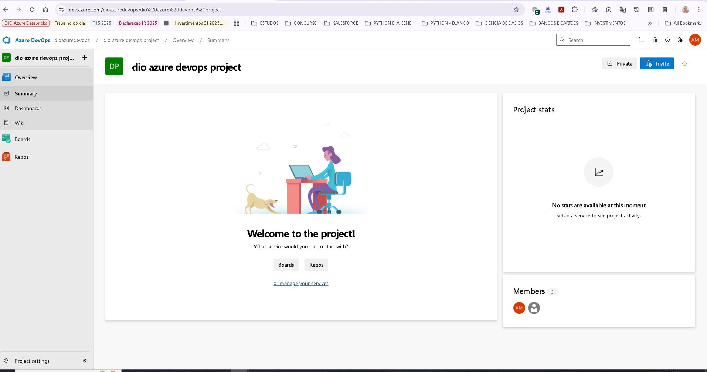
  

   
<pre> Overview do Projeto, como descrição, funcionalidades</pre>

  

    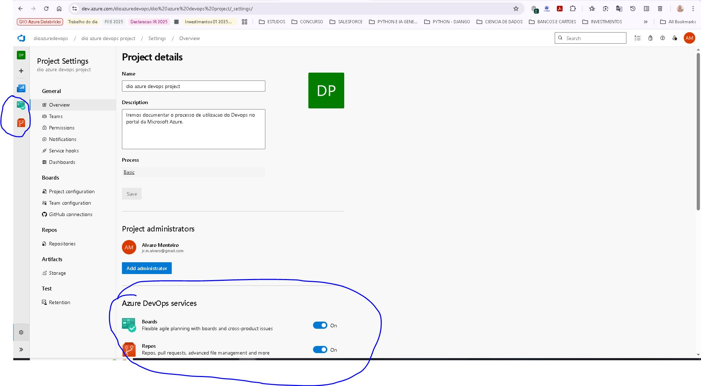
  

   
 &emsp;&nbsp;&nbsp;&nbsp; Fizemos alguns experimentos na imagem vemos que podemos configurar funcionlidades do projeto, neste caso, desabilitamos : Pipelines, Test Plan, ArtFacts, pois não serão usados no projeto.  

   
   

    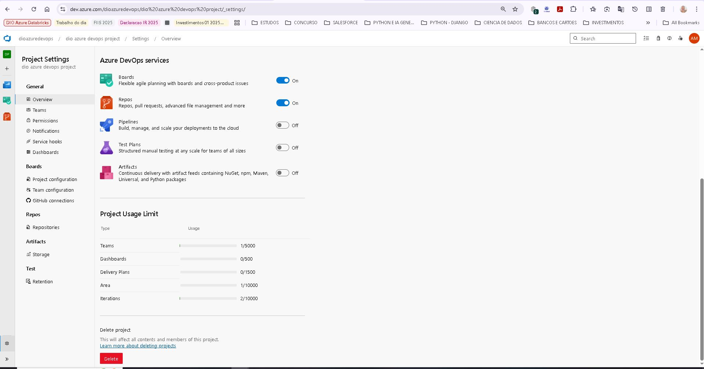
  

  <h3>Atividade 3 </h3>
  1) Aqui iremos acompanhar a Configuracao do repositorio do projeto **Repos**

  
<pre> &emsp;&nbsp;
    <b>Informações importantes:</b>
         Clone to your computer - Aqui vemos a url para poder colocar no git local no computador e trabalhar no projeto 
         Podemos ver que podemos gerar as credencias do git. Caso o projeto demanda esta ação

         Push an existing repository from comand line - Aqui vemos como podemos conectar 

         Import a repository - Temos a opção de importar um repositorio existente.

         Initialize master branck wiht REAME or gitignore - Aqui vemos que podemos criar tanto um arquivo README.md ou o arquivo gitignore, cabe ao usuario escolher.
  </pre>

  

    
 &emsp;&nbsp; Tela configuração Repos

    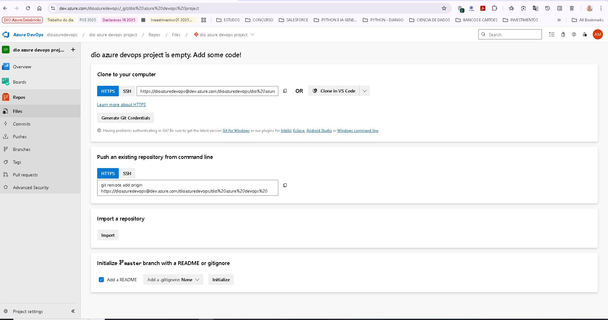
  

2) Vamos agora acompanhar a criação de 2 issues  que estão na área de backlog.

  

    
 &emsp;&nbsp; Projeto e o Board apresentado, com 2 issues, que estão alocados na área de Backlog do projeto

    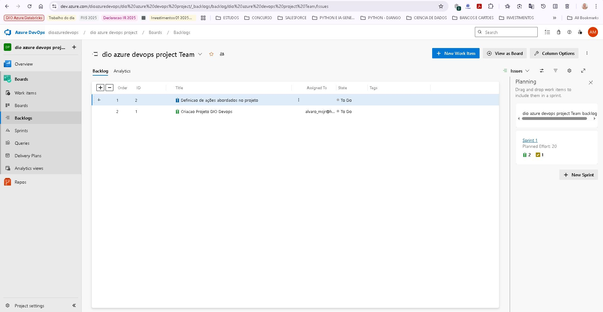
  

  

    
 &emsp;&nbsp; Abrimos um Issue para verificar as informações pertinentes. Observamos que este Issue está atribuido a um usuário e agora já é um Work Item

    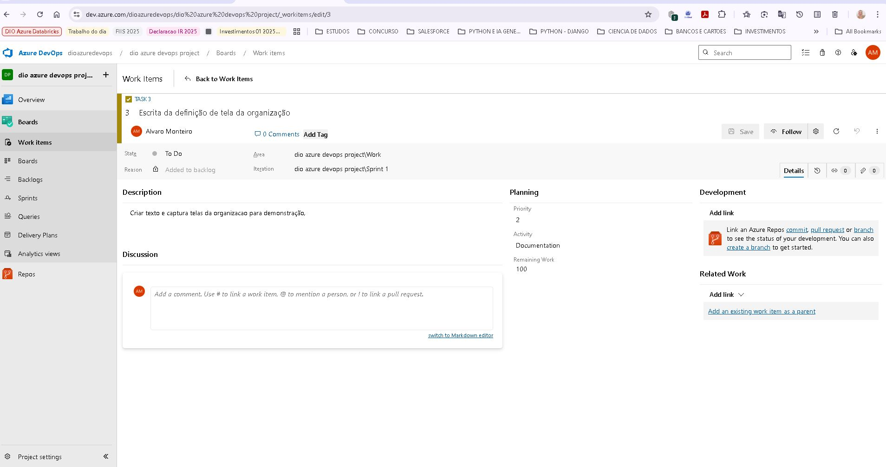
  
 

  

    
 &emsp;&nbsp; Abrimos outro  Issue para verificar as informações pertinentes. Observamos que este Issue está atribuido a um outro usuário e também é um Work Item

    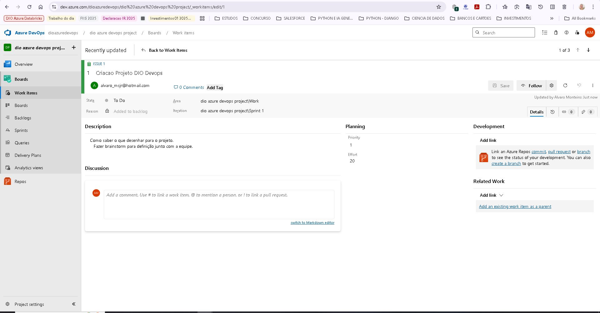
  

3) Desenho da Sprint

  

    
 &emsp;&nbsp;Acompanhamos na imagen abaixo Sprint 1 com tasks em To Do e 2 issue fora da sprint 

    
  

4) Querys 
    
    
 &emsp;&nbsp;As querys são recursos bem importantes, com elas podemos selecionar uma gama de informações a respeito, dos Issues, Tasks e Epic.
 
    
 &emsp;&nbsp; Gerando todo o suporte para a equipe do projeto e stakeholders.

  

    
 &emsp;&nbsp; Área de criação e execução das Querys 

    
  

  
 &emsp;&nbsp; Temos ainda a parte de Delivery Plan e Analitics view, que neste momento não iremos aprofundar, pois o objetivo era ver a integração DEVOPS x Data Factory, vamos seguir então.

    

  <h3>Atividade 4 </h3>
  1) Agora vamos começar a configuração do nosso Data Factory.
  
  
 &emsp;&nbsp; Bem, antes queremos lembrar que temos 2 forma de configurar o git no Data factory, que são: 

 
  

     
 &emsp;&nbsp;&nbsp;&nbsp; 1) No momento da criação  

    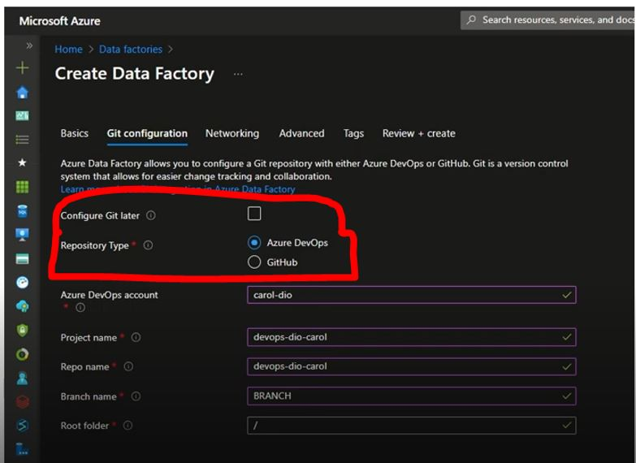
   

  

     
 &emsp;&nbsp;&nbsp;&nbsp; 2) Ou configurando o Data factory depois pelo Studio 

    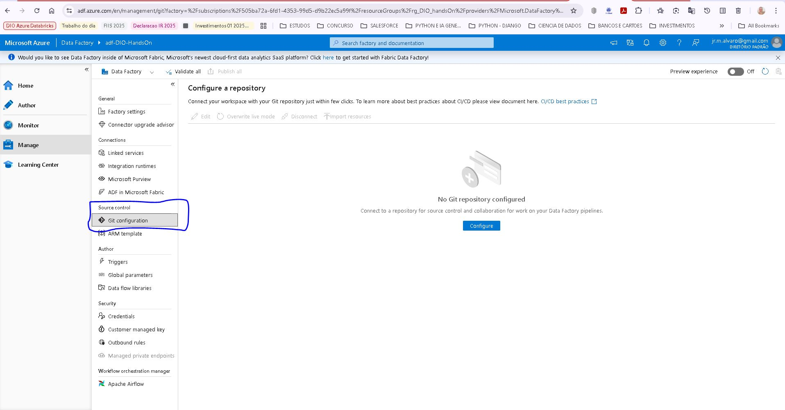
   

   
 &emsp;&nbsp;Em nosso projeto iremos por esta abordagem, visto que temos um Data Factory pronto : adf-DIO-HandsOn

 2) Configurando o Git no Data Factory adf-DIO-HandsOn.

   

     
 &emsp;&nbsp;&nbsp;&nbsp; Vemos a tela de configuracao do Data factory  

    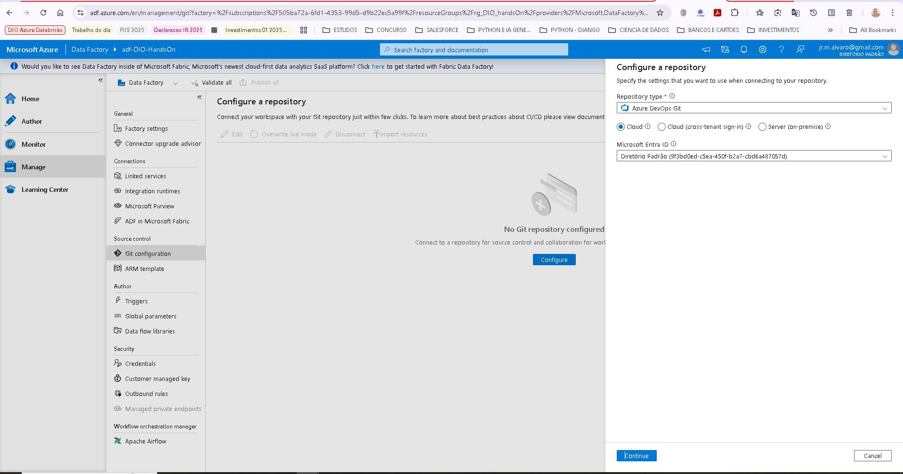
   

   
 &emsp;&nbsp; <pre>Informações necessárias: 
                         Escolha do tipo de repositorio, git ou azure devops git, no nosso caso iremos escolher o azure devops git.
                         Assinatura - Podemos escolher a assinatura que desejamos plugar o git.   
   </pre>

   

     
 &emsp;&nbsp;&nbsp;&nbsp; Detalhes da configuração.  

    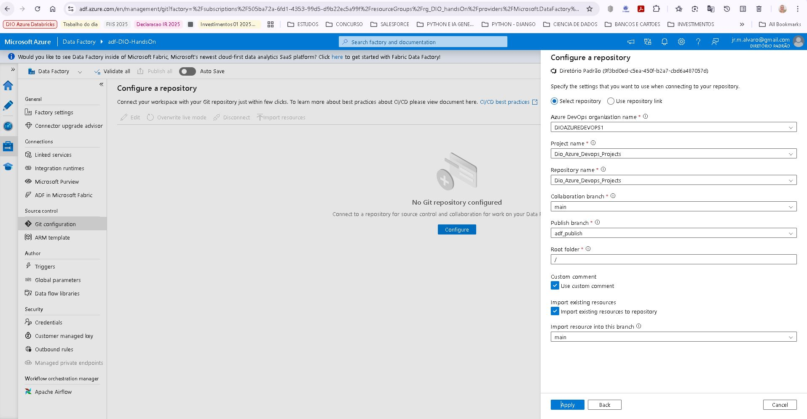
   

   
 &emsp;&nbsp; <pre>Informações necessárias: 
                         Precisamos pegar todas a informaçõe no Azure Devops Git para poder preencher os itens solicitados.
   </pre>

   

     
 &emsp;&nbsp;&nbsp;&nbsp; Sucesso na configuracao.  

    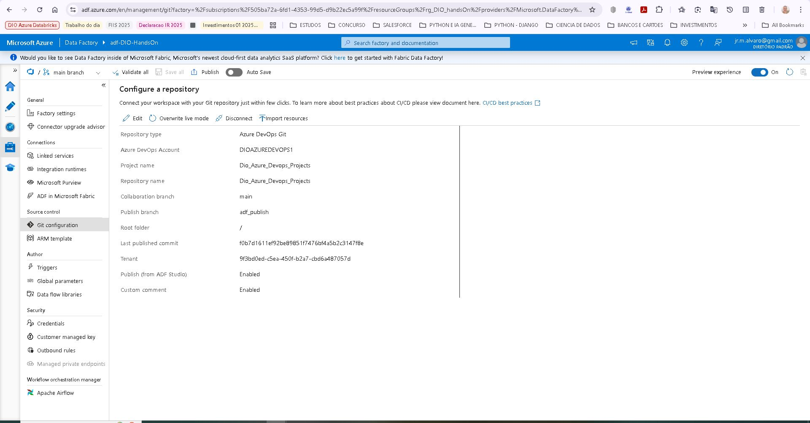
   

   
 &emsp;&nbsp; <pre> Confirmação de Sucesso na configuração: 
                         Precisamos pegar todas a informaçõe no Azure Devops Git para poder preencher os itens solicitados.
   </pre>

  
<h3>Atividade 5 </h3>

  1) Vamos agora em nosso Data Factory configurar um Pipeline
  
 &emsp;&nbsp; O objetivo e depois verificar em no Devops Azure Git as pastas criadas dentro de nossa branch 

  

    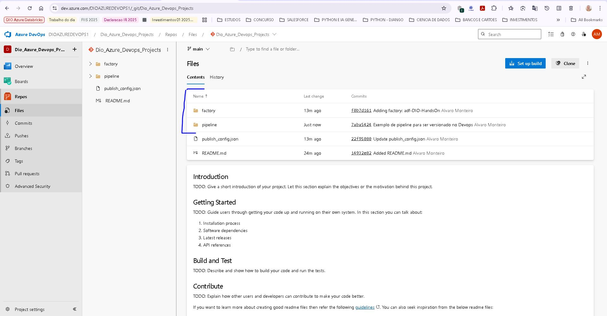
  

  
 &emsp;&nbsp; <pre> Agora vamos em no Devops Azure Git 
                         Iremos observar em no repositorio do projeto a criação da pastas :
                         factory
                         pipeline
                         e ainda o arquivo Readme.md 
                        Com isto comprovamos que estamos controlando a versão de todos os ajustes e criações feitas em nosso Data Factory
   </pre>

  

    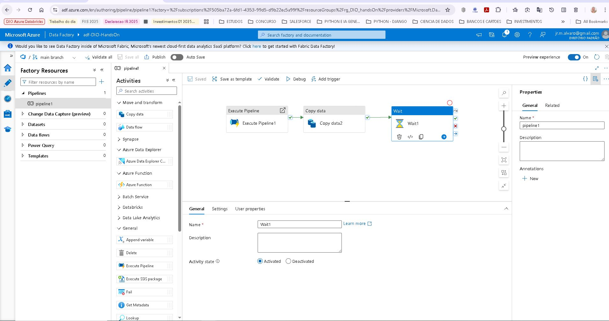
  

  

     
 &emsp;&nbsp; <pre> Commits
                         Podemos aconpanhar os momentos de criação e ajustes de nosso pipeline no Data Factory, com isto provamos 
                         que estamos controlando as versões em nosso git do desenvolvimento no Data Factory
   </pre>

    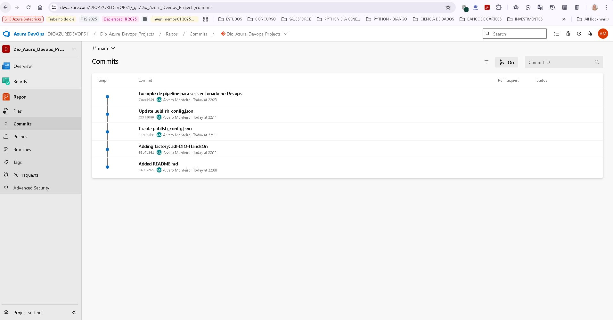
  

## Conclusão:
  
<pre>&emsp;&nbsp; Aqui pudemos explorar um pouco do processo de criação e configuração do Devops Azure Git em um recurso do Microsodt Azure, que no caso foi o Data Factory . 
                       O nosso objetivo foi explorar o básico deste processo e demonstrar a viabilidade e praticidade.
                       Com isto concluimos o nosso objetivo de demonstrar estes recursos.
  </pre>

## 👨‍💻 Desenvolvedor

    
&nbsp&nbsp&nbspAlvaro Monteiro 
    &nbsp&nbsp&nbsp
    <a href="https://github.com/Alvaro-MSJR">
    GitHub</a>&nbsp;|&nbsp;
    <a href="www.linkedin.com/in/alvaro-monteiro-silva">LinkedIn</a>
&nbsp;|&nbsp;

  

---
⌨️ conteúdo por [Alvaro Monteiro](https://github.com/Alvaro-MSJR)